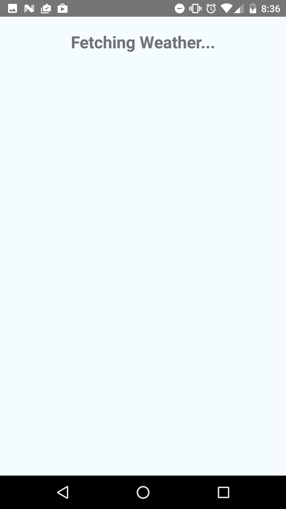
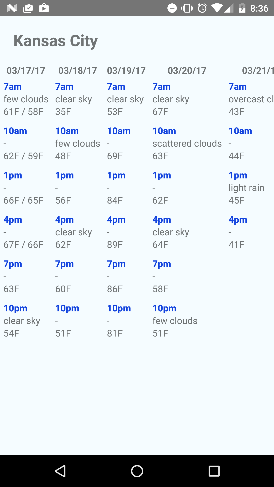
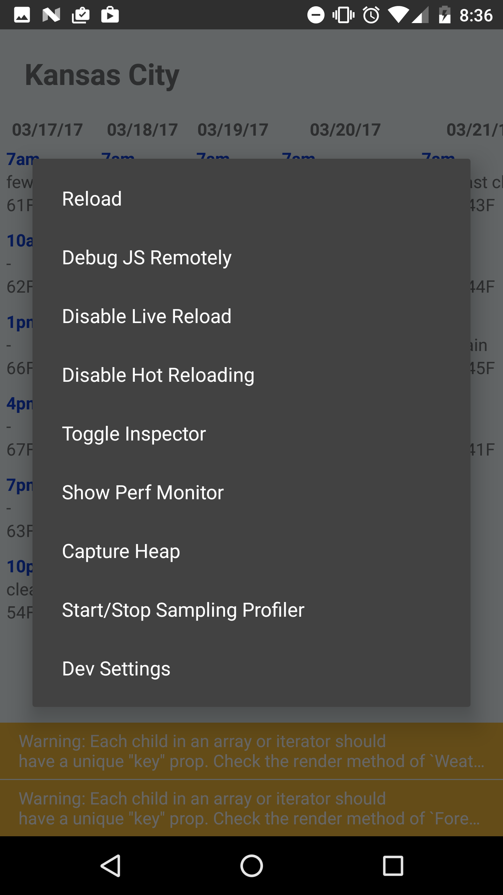

# Weather App
[![Build Status][ci-image]][ci-url] [![dependencies][dependencies-image]][dependencies-url] [![dev-dependencies][dev-dependencies-image]][dev-dependencies-url]

| Screenshots |     |
| ----------- | --- |
|  |  |
|  |   |


## From PayIt Interview README

This little guide should enable you to get cracking.

### Instructions ###

* In this directory is a bare bones React Native project. - https://facebook.github.io/react-native/
* You should integrate with a weather API and create a mobile app that will display the 5 day forecast for Kansas City.
* Here are some weather APIs you might consider:
*  - http://openweathermap.org/forecast5
*  - https://developer.yahoo.com/weather/

## Origins

This repository originates from https://github.com/mrpatiwi/ReactNativeTS


Minimal template of a [React Native](https://facebook.github.io/react-native/) project with [Typescript](https://www.typescriptlang.org/).


> Recommended usage with [VSCode](https://code.visualstudio.com/)

## Getting Started

You will need to rename/create a copy of `/src/env.example.ts` to `/src/env.ts` with your API keys and City ID data.

Understand that this works by first compiling TypeScript and then deploying the JavaScript with React Native.

* Requirements: [Node.js](https://nodejs.org) and [Yarn](https://yarnpkg.com/)

Clone this repository:

```sh
git clone https://github.com/ZombieHippie/weather-react-native.git
cd ReactNativeTS
```

Install dependencies:

```sh
yarn
```

Start React Native server:

```sh
yarn start
```

Build the source-code with Typescript:

```sh
# Build once
yarn run build

# Build and watch for changes
yarn run build -- --watch
```

### iOS

```sh
yarn run ios
```

### Android

```sh
yarn run android
```

[ci-image]: https://travis-ci.org/ZombieHippie/weather-react-native.svg
[ci-url]: https://travis-ci.org/ZombieHippie/weather-react-native
[dependencies-image]: https://david-dm.org/ZombieHippie/weather-react-native.svg
[dependencies-url]: https://david-dm.org/ZombieHippie/weather-react-native
[dev-dependencies-image]: https://david-dm.org/ZombieHippie/weather-react-native/dev-status.svg
[dev-dependencies-url]: https://david-dm.org/ZombieHippie/weather-react-native#info=devDependencies
